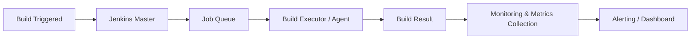

## Jenkins - Monitoring Metrics

---

## Author Information
| Last Updated On | Version | Author           | Level           | Reviewer               |
|-----------------|---------|------------------|-----------------|------------------------|
| 15-08-2025      | V1.0    | Kawalpreet Kour  | Internal Review | Pritam                 |
|                 |         | Kawalpreet Kour  | L0              | Shreya/Sharvari        |
|                 |         | Kawalpreet Kour  | L1              | Abhishek V             |
|                 |         | Kawalpreet Kour  | L2              | Abhishek Dubey/Rishabh sharma |

---

  
<h2><strong>Table of Contents</strong></h2>

- [Introduction](#introduction)
- [What is Jenkins Monitoring?](#what-is-jenkins-monitoring)
- [Why Monitor Jenkins?](#why-monitor-jenkins)
- [Workflow Diagram](#workflow-diagram)
- [Different Types of Metrics](#different-types-of-metrics)
- [Advantages of Jenkins Monitoring](#advantages-of-jenkins-monitoring)
- [Best Practices](#best-practices)
- [Conclusion](#conclusion)
- [FAQs](#faqs)
- [References](#references)

---

## Introduction
This document provides a structured guide to monitoring Jenkins, tracking key metrics, and setting up alerts to ensure stable and efficient CI/CD pipelines.

---

## What is Jenkins Monitoring?
Jenkins Monitoring is the process of continuously tracking the performance of Jenkins, including build metrics, system metrics, and node status, to detect issues early, optimize CI/CD workflows, and ensure the reliability and efficiency of the pipeline.

---

## Why Monitor Jenkins?

| Reason | Explanation |
|--------|-------------|
| Early Detection of Failures | Identify broken builds or pipeline issues before they affect production. |
| Performance Optimization | Monitor CPU, memory, and queue metrics to optimize server resources. |
| Scalability Planning | Analyze trends to determine when to scale Jenkins nodes. |
| Reliability & Availability | Detect and resolve bottlenecks or server crashes to avoid downtime. |
| Resource Management | Ensure efficient usage of build nodes and other system resources. |

---

## Workflow Diagram

---

## Different Types of Metrics

| Metric Category  | Metric              | Description                             | Example Threshold / Alert         |
| ---------------- | ------------------ | ---------------------------------------  | --------------------------------- |
| Build Metrics    | Build Success Rate  | % of successful builds vs failed builds | Alert if < 95%                    |
| Build Metrics    | Build Duration      | Time taken for each job or pipeline     | Alert if > 30% longer than average |
| Queue Metrics    | Queue Size          | Number of jobs waiting in queue         | Alert if > 5 jobs                 |
| Queue Metrics    | Blocked Jobs        | Jobs waiting on unavailable resources   | Alert if > 2 jobs blocked         |
| System Metrics   | CPU Usage           | CPU load on Jenkins master              | Alert if > 80%                    |
| System Metrics   | Memory Usage        | JVM heap & non-heap memory              | Alert if > 75%                    |
| Executor Metrics | Busy Executors      | Number of active executors              | Alert if all busy > 5 min         |
| Plugin Metrics   | Failed Plugins      | Plugins that failed to start            | Alert if > 0                      |
| Plugin Metrics   | Upgradeable Plugins | Plugins with available updates          | Alert if > 0                      |

> **Note:** Metrics can be monitored using tools like **Prometheus + Grafana** (via `/prometheus/` endpoint), Jenkins plugins, or dashboards like **JavaMelody** for JVM/system metrics.

---
## Advantages of Jenkins Monitoring

| Reason | Explanation |
|--------|-------------|
| Increased Stability | Monitoring ensures CI/CD pipelines remain stable by proactively identifying issues. |
| Better Resource Management | Tracks system and node metrics to optimize usage of build nodes and server resources. |
| Reduced Downtime | Alerts on failures or bottlenecks allow quick resolution, minimizing downtime. |
| Faster Response to Failures | Teams can respond quickly to build failures or system issues. |
| Historical Insights | Provides data for trend analysis and continuous improvement of CI/CD processes. |

---

## Best Practices

| Practice | Explanation |
|----------|-------------|
| Centralized Monitoring | Use tools like Prometheus + Grafana or ELK stack for unified monitoring. |
| Define Alerts & Thresholds | Set realistic thresholds to avoid alert fatigue while catching critical issues. |
| Track Trends | Monitor build duration, failure rates, and resource usage over time for better planning. |
| Automate Remediation | Auto-restart Jenkins jobs or agents when failures occur to reduce manual intervention. |
| Secure Monitoring | Restrict access to dashboards and monitoring tools to ensure security. |

---

## Conclusion
Monitoring Jenkins ensures stable CI/CD pipelines, efficient resource usage, and faster response to issues. Dashboards with Prometheus and Grafana provide real-time insights and alerts.

---
## FAQs

1. **How do I get alerts for Jenkins issues?**  
   Use Jenkins plugins or Prometheus + Grafana to trigger notifications on failures or high resource usage.

2. **Which metrics are most important to monitor?**  
   Build success rate, build duration, queue times, CPU/memory, and executor usage.

3. **How often should I check metrics?**  
   Real-time dashboards for active builds; review historical trends weekly or monthly.

---

## Contact Information

| Name             | Email                          |
|------------------|--------------------------------|
| Kawalpreet Kour  | kawalpreet.kour.snaatak@mygurukulam.co |

## References

| Description                   | Link                                        |
|-------------------------------|---------------------------------------------|
| Jenkins Official Documentation | https://www.jenkins.io/doc/                 |
| Prometheus Documentation       | https://prometheus.io/docs/                 |
| Grafana Documentation          | https://grafana.com/docs/                   |

